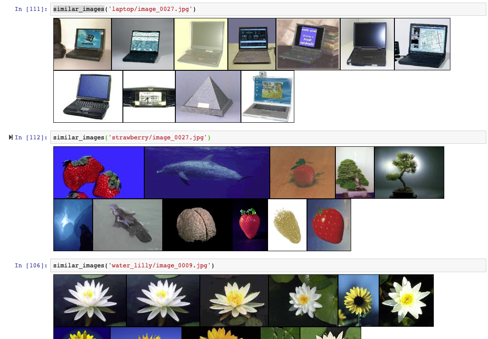

# Perceptual Image Similarity Search

Deep Learning-enhanced image similarity search powered by Keras & LSHash.

Using feature vectors extracted from pretrained Neural Networks to perform similarity search in a semantic latent space instead of pixel space of [Caltech 101](http://www.vision.caltech.edu/Image_Datasets/Caltech101/) images.

## Outline

1. Perform inference on convolutional layers of VGG16 (pretrained on Imagenet data) to extract feature representations using Keras
2. Index feature vectors using LSHash
3. Query similar feature vectors using cosine-similarity 

## Example

Image in the upper left is original query image, others are similar images from the Caltech 101 Dataset 

## Next Steps

- perform transfer learning or fine-tuning on pretrained network using caltech beforehand
- perform dimensionality reduction on feature vectors (e.g. using feature selection, Autoencoder or PCA)